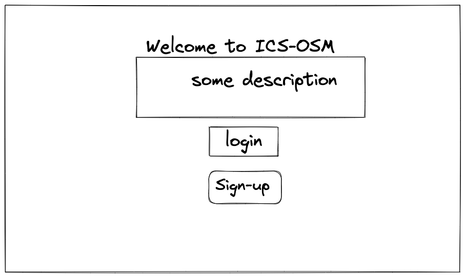
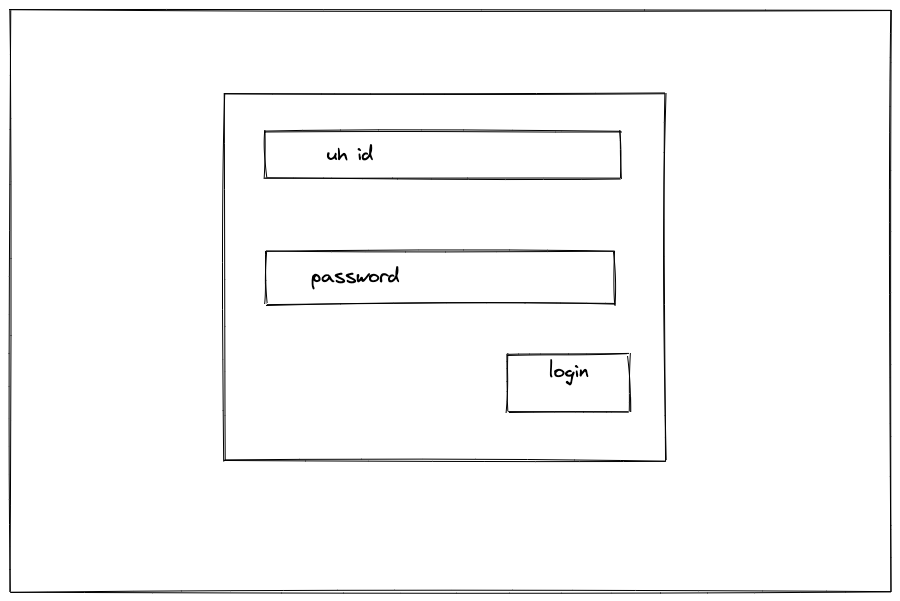

# Change Me

## Table of Contents
* [Overview](#overview)
* [Goals](#goals)
* [What Our Application Provides](#what-our-application-provides)
* [Mockup Pages](#mockup-pages)
* [User Guide](#user-guide)
* [Developer Guide](#developer-guide)
* [Development History](#development-history)
* [Deployment](#deployment)
* [Quality Assurance](#quality-assurance)
* [Team Members](#team-members)

## Overview
In progress

## Goals
In progress

## What Our Application Provides
In progress

## Mockup Pages

### Landing Page

  

### Sign-In

  

### Default Pages for Each Role

  

### Calendar

  

### Faculty Page

  

### Add Proffesor

  

### Room Page

  

## User Guide
In progress

## Developer Guide
In progress

## Development History
- **[M1](https://github.com/orgs/ics414t3/projects/1/views/1)** (Milestone 1)
  - Completed Mockups

## Deployment
In progress

## Quality Assurance
In progress

## Team Members
- Devin Arquines
- James Louie Grande
- Malia Liu
- Susan Ma
- Gwyneth Raquepo
- Giorgio Tran
- Jerome Wasserman

[Team Contract](./team-contract.pdf)

For comments or questions, please contact us via our project's [GitHub](#).
