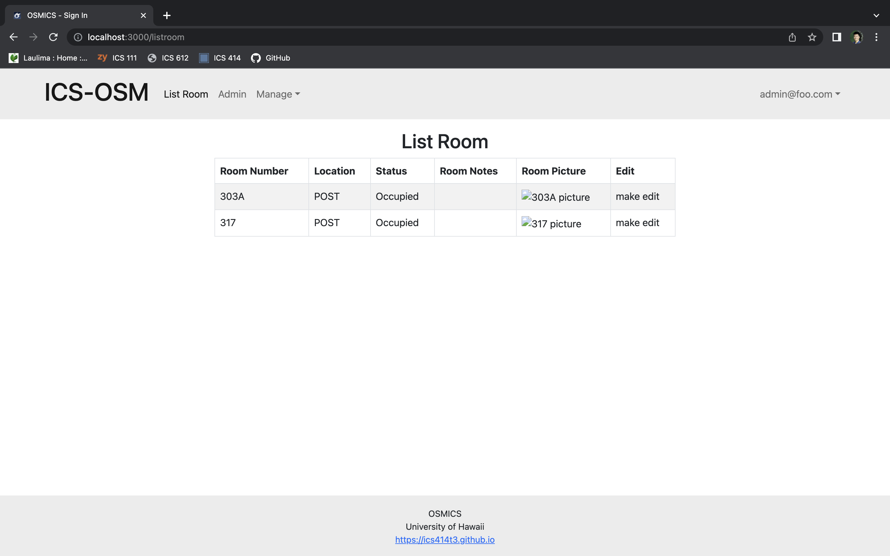

# OSMICS

## Table of Contents
* [Overview](#overview)
* [Goals](#goals)
* [What Our Application Provides](#what-our-application-provides)
* [Mockup Pages](#mockup-pages)
* [User Guide](#user-guide)
* [Developer Guide](#developer-guide)
* [Development History](#development-history)
* [Deployment](#deployment)
* [Quality Assurance](#quality-assurance)
* [Team Members](#team-members)

## Overview
The ICS department is in need of an office space management system. Currently, there is no management system, which makes it difficult to reassign offices or assess rooms' inventory.

## Goals
Our goal is to develop a user friendly application that can assist the entire ICS department with distribution of key information and management.

## What Our Application Provides
This application will mainly provide the ICS Department's administrative office and tech support with an inventory and office space management system. Additionally, students and faculty also have access to the site, but with a different scope. Faculty can book conference rooms, and can update their office hours. Students on the other hand can look up faculty members, or locate where a certain room may be. 

## Mockup Pages

### Landing Page
What the user sees when they first go to the site.

  

### Sign-In
Where the user can sign-in.

  

### Default Pages for Each Role
Content may differ depending on role upon logging in.

  

### Admin Page
Admin can see all of the users and modify their information.

  

### Admin List Room
Admin can see all of the rooms and modify their information.

  

### Calendar

  

### Faculty Page

  

### Add Professor

  

### Room Page

  

## User Guide
In progress

## Developer Guide
In progress

## Development History
- **[M1](https://github.com/orgs/ics414t3/projects/1/views/1)** (Milestone 1)
  - Completed Mockups

## Deployment
In progress

## Quality Assurance
In progress

## Team Members
- Devin Arquines
- James Louie Grande
- Malia Liu
- Susan Ma
- Gwyneth Raquepo
- Giorgio Tran
- Jerome Wasserman

[Team Contract](./team-contract.pdf)

For comments or questions, please contact us via our project's [GitHub](https://github.com/ics414t3).
